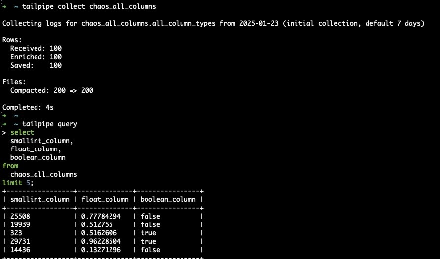

# Chaos Plugin for Tailpipe

[Tailpipe](https://tailpipe.io) is an open-source CLI tool that allows you to collect logs and query them with SQL.

The [Chaos Plugin for Tailpipe](https://hub.tailpipe.io/plugins/turbot/chaos) allows you to collect and query all column types table, all numeric column type table and more to test your plugins.

- **[Get started →](https://hub.tailpipe.io/plugins/turbot/chaos)**
- Documentation: [Table definitions & examples](https://hub.tailpipe.io/plugins/turbot/chaos/tables)
- Community: [Join #tailpipe on Slack →](https://turbot.com/community/join)
- Get involved: [Issues](https://github.com/turbot/tailpipe-plugin-chaos/issues)

Collect and query logs:


## Getting Started

Install Tailpipe from the [downloads](https://tailpipe.io/downloads) page:

```sh
# MacOS
brew install turbot/tap/tailpipe
```

```sh
# Linux or Windows (WSL)
sudo /bin/sh -c "$(curl -fsSL https://tailpipe.io/install/tailpipe.sh)"
```

Install the plugin:

```sh
tailpipe plugin install chaos
```

Configure table partition, and data source ([examples](https://hub.tailpipe.io/plugins/turbot/chaos/tables/chaos_all_columns#example-configurations)):

```sh
vi ~/.tailpipe/config/chaos.tpc
```

```hcl
partition "chaos_all_columns" "chaos_all_column_types" {
  source "chaos_all_columns" {
    row_count = 1
  }
}

partition "chaos_date_time" "date_time_inc" {
  source "chaos_date_time" {
    row_count = 100
  }
}

partition "chaos_date_time" "struct_columns" {
  source "chaos_struct_columns" {
    row_count = 100
  }
}
```

Download, enrich, and save logs from your source ([examples](https://tailpipe.io/docs/reference/cli/collect)):

```sh
tailpipe collect chaos_all_columns
tailpipe collect chaos_date_time
tailpipe collect chaos_date_time
```

Enter interactive query mode:

```sh
tailpipe query
```

Run a query:

```sql
select
  event_source,
  event_name,
  count(*) as event_count
from
  chaos_all_columns
where
  not read_only
group by
  event_source,
  event_name
order by
  event_count desc;
```

```sh
+----------------------+-----------------------+-------------+
| event_source         | event_name            | event_count |
+----------------------+-----------------------+-------------+
| logs.amazonchaos.com   | CreateLogStream       | 793845      |
| ecs.amazonchaos.com    | RunTask               | 350836      |
| ecs.amazonchaos.com    | SubmitTaskStateChange | 190185      |
| s3.amazonchaos.com     | PutObject             | 60842       |
| sns.amazonchaos.com    | TagResource           | 25499       |
| lambda.amazonchaos.com | TagResource           | 20673       |
+----------------------+-----------------------+-------------+
```

## Developing

Prerequisites:

- [Tailpipe](https://tailpipe.io/downloads)
- [Golang](https://golang.org/doc/install)

Clone:

```sh
git clone https://github.com/turbot/tailpipe-plugin-chaos.git
cd tailpipe-plugin-chaos
```

After making your local changes, build the plugin, which automatically installs the new version to your `~/.tailpipe/plugins` directory:

```sh
make
```

Re-collect your data:

```sh
tailpipe collect chaos_all_columns
```

Try it!

```sh
tailpipe query
> .inspect chaos_all_columns
```

## Open Source & Contributing

This repository is published under the [Apache 2.0](https://www.apache.org/licenses/LICENSE-2.0) (source code) and [CC BY-NC-ND](https://creativecommons.org/licenses/by-nc-nd/2.0/) (docs) licenses. Please see our [code of conduct](https://github.com/turbot/.github/blob/main/CODE_OF_CONDUCT.md). We look forward to collaborating with you!

[Tailpipe](https://tailpipe.io) is a product produced from this open source software, exclusively by [Turbot HQ, Inc](https://turbot.com). It is distributed under our commercial terms. Others are allowed to make their own distribution of the software, but cannot use any of the Turbot trademarks, cloud services, etc. You can learn more in our [Open Source FAQ](https://turbot.com/open-source).

## Get Involved

**[Join #tailpipe on Slack →](https://turbot.com/community/join)**

Want to help but don't know where to start? Pick up one of the `help wanted` issues:

- [Tailpipe](https://github.com/turbot/tailpipe/labels/help%20wanted)
- [Chaos Plugin](https://github.com/turbot/tailpipe-plugin-chaos/labels/help%20wanted)
